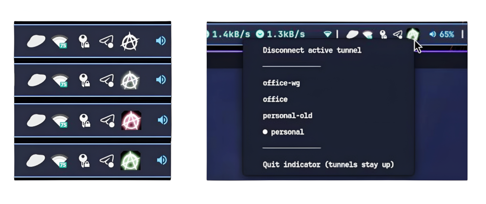

# awg-go

Linux system-tray indicator for [AmneziaWG](https://docs.amnezia.org/) tunnels.
Inspired by [yd-go](https://github.com/slytomcat/yd-go).

## Screenshot



*Hyprland + waybar; per-tunnel colours from the default
[Catppuccin](https://catppuccin.com/) palette. To override the palette flavour
or pin specific colours per tunnel, see [Customisation](#customisation).*

## Features (v1)

- Connected / disconnected indication in the tray.
- One auto-coloured icon per discovered config under `/etc/amnezia/amneziawg/`.
- Bring tunnels up and down from the tray menu (single-active model).
- Active tunnel marked in the menu with a `●` prefix.
- One-click **Disconnect active tunnel** entry at the top of the menu.
- Desktop notifications on state changes.
- Status via netlink — no privileges required for monitoring.

## Install

Pick one of the three options. All three produce the same `~/.local/bin/awg-go`;
they differ only in where the binary comes from. After installing, do the
[post-install setup](#post-install-setup) — sudoers + config-dir permissions —
and then pick an [autostart](#autostart) method.

### Option 1: Tarball (recommended)

Grab the latest tarball from the [Releases page][releases] for your
architecture (`linux-amd64` or `linux-arm64`). It contains the binary plus
`.desktop`/`.service` units and the sudoers template:

```sh
tar -xzf awg-go-vX.Y.Z-linux-amd64.tar.gz
install -D -m 0755 awg-go ~/.local/bin/awg-go
# keep awg-go.desktop, awg-go.service, docs/sudoers-awg-go around — you'll
# reference them from the post-install and autostart sections below.
```

### Option 2: Standalone binary

If you only want the binary (e.g. you'll write your own unit file):

```sh
curl -L -o awg-go \
  https://github.com/kowalski/awg-go/releases/download/vX.Y.Z/awg-go-vX.Y.Z-linux-amd64
install -D -m 0755 awg-go ~/.local/bin/awg-go
```

You'll need `awg-go.desktop`, `awg-go.service`, and `docs/sudoers-awg-go`
fetched separately (from the same release or this repo) for the sections
below.

### Option 3: Build from source

Requires Go ≥ 1.26 and a checkout of this repo.

```sh
./build.sh                                    # bakes git-describe version in
install -D -m 0755 awg-go ~/.local/bin/awg-go
```

[releases]: https://github.com/kowalski/awg-go/releases

(`~/.local/bin` is on `PATH` by default on most modern desktops; if not, add it
to your shell init.)

## Post-install setup

awg-go itself runs as your user. To bring tunnels up and down it shells out to
`sudo -n awg-quick`, so you need a sudoers entry. Install
`docs/sudoers-awg-go` (shipped in the tarball, or take it from this repo) and
substitute your username:

```sh
sudo install -m 0440 docs/sudoers-awg-go /etc/sudoers.d/awg-go
sudo sed -i "s/%user%/$USER/" /etc/sudoers.d/awg-go
sudo visudo -c -f /etc/sudoers.d/awg-go
```

### Make the config directory listable

AmneziaWG's default install makes `/etc/amnezia/amneziawg/` mode `700 root:root`,
which means awg-go can't even see the filenames. The tray only ever reads
filenames — never file contents — so it's enough to make the directory itself
readable while the individual `.conf` files (which contain private keys) stay
`600 root:root`:

```sh
sudo chmod 755 /etc/amnezia/amneziawg
```

After this, `ls /etc/amnezia/amneziawg/` works as your user but `cat <file>.conf`
still requires root.

## Autostart

Pick one of the two options below — don't enable both.

### Option A: XDG `.desktop` autostart (default desktop behaviour)

```sh
cp awg-go.desktop ~/.config/autostart/
```

The desktop file expects `awg-go` on `PATH` (e.g. installed at
`~/.local/bin/awg-go` per the previous step). GNOME/KDE/XFCE/Cinnamon/MATE all
honour this directory.

### Option B: systemd user service

If you prefer systemd to manage the lifecycle (auto-restart on crash, journal
logs, `systemctl --user status awg-go`):

```sh
install -D -m 0644 awg-go.service ~/.config/systemd/user/awg-go.service
systemctl --user daemon-reload
systemctl --user enable --now awg-go.service
```

Check status / logs:

```sh
systemctl --user status awg-go.service
journalctl --user -u awg-go.service -f
```

The unit installs into `default.target` (always present in user mode) with a
soft `Wants=`/`After=graphical-session.target`, so it starts at user-session
boot and orders itself behind a graphical session if your DE activates one.
GNOME, KDE Plasma, and Hyprland with systemd integration all do; on stock
Hyprland the soft dep is simply skipped — the tray itself retries connecting
to the panel host until it appears.

The binary path is `%h/.local/bin/awg-go` — if you installed elsewhere, edit
`ExecStart` before enabling.

## Update

Replace `~/.local/bin/awg-go` with the new binary (download the new tarball or
binary, or `git pull && ./build.sh` if you built from source), then:

```sh
install -m 0755 awg-go ~/.local/bin/awg-go
```

Then restart whichever autostart you chose:

- **systemd user service:** `systemctl --user restart awg-go.service`
- **`.desktop` autostart (or running manually):** `pkill awg-go && (~/.local/bin/awg-go &)`

A running tray will not pick up a new binary until restarted.

## Configuration

A default config file is created on first run at
`~/.config/awg-go/config.toml`. See [Customisation](#customisation) below
for the available keys.

## Customisation

The config file at `~/.config/awg-go/config.toml` accepts two optional sections.

### Palette flavour

awg-go's default palette is [Catppuccin Mocha](https://catppuccin.com/palette).
You can switch to any of the four flavours:

```toml
[palette]
flavour = "latte"   # mocha | latte | frappe | macchiato
```

Names are case-insensitive. An unknown flavour falls back to mocha with a
warning in the log.

### Per-tunnel colour overrides

By default each tunnel is auto-assigned a colour from the palette via a stable
hash of its name. Override on a per-tunnel basis under `[tunnels.<name>]`:

```toml
[tunnels.office]
colour = "#a6e3a1"   # any "#rrggbb" hex

[tunnels.home]
colour = "none"      # never render the indicator dot for this tunnel

[tunnels.work]
colour = "static"    # render base.png + tint.png as-authored, ignoring colour
```

`colour = "none"` is useful when you only have one tunnel and don't need a
colour identifier — the icon stays clean (just the base shield) whether the
tunnel is up or down.

`colour = "static"` is for when your icon assets carry their own design
(e.g. a multi-colour logo) and you don't want awg-go recolouring them per
tunnel. Both `base.png` and `tint.png` are composited as authored; every
"static" tunnel looks identical.

Invalid hex values fall back to the auto-hashed colour with a log warning.
TOML changes require a process restart.

### Icon rendering: soft vs opaque alpha

Some tray hosts (Hyprland's waybar, certain GNOME setups) misrender tray
icons that contain semi-transparent pixels — dimming the colour or replacing
it with the panel foreground colour. The default rendering is therefore
"every visible pixel α=255", trading mask-gradient soft edges for guaranteed
correct colour.

If your tray respects alpha properly (KDE Plasma, GNOME Shell with the
AppIndicator extension respect partial alpha well), you can opt in to
mask-driven soft edges:

```toml
[icons]
soft_alpha = true
```

## Custom icon shapes (developer)

The icon is composed at runtime from two embedded PNGs in `internal/icons/`:

- `base.png` (32×32 RGBA) — the always-rendered background. Authored in a
  panel-neutral tone so it reads on both light and dark panels.
- `tint.png` (32×32, alpha-only) — defines the indicator region. RGB is
  ignored; only the alpha channel matters. The tunnel colour is composited
  over the base wherever this mask has alpha > 0.

To replace the shape, drop in your own PNGs at the same paths and rebuild.
Both files are embedded via `go:embed`.

## Limitations

- Single-active only: clicking another tunnel auto-disconnects the current one.
- AmneziaWG only — WireGuard support is planned.
- No in-app config editing.
- English only.
